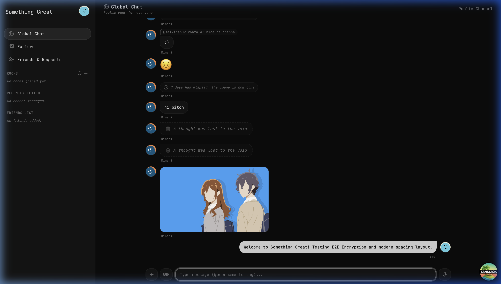
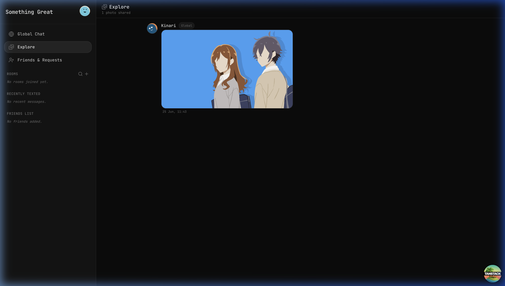

# 🌌 Something Great

> **A Secure, High-Performance, End-to-End Encrypted Real-Time Chat Application**

[](https://convex.dev)
[](https://react.dev)
[](https://www.typescriptlang.org/)
[](https://tailwindcss.com)
[](https://bun.sh)

---

**Something Great** is a premium, real-time messaging application designed with client-side **End-to-End Encryption (E2EE)** at its core. Built on top of **TanStack Start** (Vite + React Router) and powered by **Convex** serverless backend, it delivers instant message synchronization, voice notes, and media sharing under a sleek, glassmorphic dark-mode interface.

---

## 📸 Screenshots

| 💬 Chat Interface | 🖼️ Explore Shared Photos |
|:---:|:---:|
|  |  |

---

## ✨ Key Features

*   🔒 **Zero-Knowledge E2E Encryption:** All text, audio recordings, and image attachments are encrypted in-browser using **AES-GCM (256-bit)** before being sent. Keys are exchanged securely using **RSA-OAEP**.
*   🔑 **Key Backup & Recovery:** Passphrase-derived backup keys (via **PBKDF2**) stored securely on the database allow users to restore private RSA keys when signing in from new devices.
*   💬 **Diverse Room Types:**
    *   **Global Chat:** Open public discussion channel.
    *   **Custom Rooms:** Public or Private rooms (private rooms require join approvals or passwords).
    *   **Direct Messages (DMs):** Private 1-on-1 chats with live typing indicators and read receipts.
*   🖼️ **Global Explore Feed:** A clean, vertical scrolling feed collecting all shared images across all rooms you are a member of, decrypted on-demand with correct natural aspect ratios.
*   🎤 **Voice Messaging:** Record, send, and play encrypted audio files through a customized, wave-styled inline audio player.
*   👾 **GIF Integration:** Search and share animated GIFs instantly via GIPHY API.
*   ↩️ **Swipe-to-Reply & Mentions:** Swipe any message bubble left to trigger a contextual reply, and tag users with autocomplete-assisted `@username` mentions.
*   🛠️ **Native-Feel Gestures & Actions:**
    *   **PC:** Right-click message bubbles to reveal actions.
    *   **Mobile:** Long-press (500ms hold) to trigger a native-feeling bottom slide-up actions drawer.
    *   **Purging:** Deleting messages wipes the encrypted database contents and deletes the assets from UploadThing, leaving clean contextual notes (e.g., *"Visual memory collapsed into a black hole"*).

---

## 🛠️ Technology Stack

*   **Runtime & Package Manager:** [Bun](https://bun.sh)
*   **Frontend Framework:** [TanStack Start](https://tanstack.com/start) (React 19 + React Router)
*   **Backend & DB:** [Convex](https://convex.dev)
*   **File Storage:** [UploadThing](https://uploadthing.com)
*   **Analytics:** [PostHog](https://posthog.com)
*   **CSS Styling:** Tailwind CSS v4

---

## 🚀 Getting Started & Setup

Follow this step-by-step guide to clone, configure, and launch the application locally.

### 1. Prerequisites

Make sure you have [Bun](https://bun.sh) installed. You will also need credentials from the following free services:
*   [Convex Account](https://convex.dev)
*   [UploadThing Account](https://uploadthing.com) (for file/audio storage)
*   [GIPHY Developer API Key](https://developers.giphy.com) (for GIF picker search)
*   [PostHog Account](https://posthog.com) (Optional - for analytics)

### 2. Environment Variables Configuration

Create a `.env.local` file in the root of the project:

```bash
touch .env.local
```

Populate `.env.local` with the following variables:

| Variable Name | Description | Source |
| :--- | :--- | :--- |
| `CONVEX_DEPLOYMENT` | Convex project ID | Automatically generated during step 4 |
| `VITE_CONVEX_URL` | Cloud Convex database URL | Automatically generated during step 4 |
| `UPLOADTHING_TOKEN` | Auth token for storage uploads | API Keys page in UploadThing Dashboard |
| `VITE_GIPHY_API_KEY` | Key for GIPHY search | API Key from GIPHY Developer portal |
| `VITE_POSTHOG_KEY` | Analytics key (Optional) | Project Settings page in PostHog Dashboard |

> [!IMPORTANT]
> To enable backend media purging (e.g. deleting image files when deleting messages), you must add your `UPLOADTHING_TOKEN` to your **Convex Dashboard Environment Variables** as well.

### 3. Installation

Install project dependencies using Bun:

```bash
bun install
```

### 4. Running the App

1.  **Start and configure the Convex Backend:**
    ```bash
    bun convex dev
    ```
    *If this is your first run, you will be prompted to log in and select/create a dev deployment. It will automatically compile and synchronize backend schemas, indexes, and queries, and populate your `.env.local` file.*

2.  **Deploy backend functions once (alternative to running dev continuously):**
    ```bash
    npx convex dev --once
    ```

3.  **Start the local development server:**
    ```bash
    bun dev
    ```

4.  Open [http://localhost:3000](http://localhost:3000) in your web browser.

---

## 🧪 Quality Assurance & Scripts

*   **Run Unit & Integration Tests (Vitest):**
    ```bash
    bun run test
    ```
*   **Lint the codebase:**
    ```bash
    bun run lint
    ```
*   **Format the code:**
    ```bash
    bun run format
    ```
*   **Compile a production build:**
    ```bash
    bun run build
    ```

---

## 🔒 Cryptography Design Details

<details>
<summary>Click to view E2E Encryption Protocol & Key Exchange details</summary>

The Convex server is completely "blind" to all conversations. Text, image files, and audio recordings are encrypted inside the client browser.

1.  **User Key Pairs:** Upon registration, the browser uses the **Web Crypto API** to generate a unique **RSA-OAEP (2048-bit) Key Pair**. The public key is uploaded to Convex so other users can exchange secrets with you. The private key remains stored securely inside the browser's local IndexedDB.
2.  **Room Symmetric Keys:** Every DM and private room is assigned a dedicated **AES-GCM (256-bit) symmetric key**.
3.  **Key Exchange Flow:** When a conversation starts, the chatroom's AES key is encrypted using the recipient's RSA public key. Only the recipient's local private key can decrypt and use this AES key to unlock messages.
4.  **Message Encryption:** When you type a message or upload an attachment, the client encrypts the payload using the room's AES-GCM key and a random Initialization Vector (IV).
5.  **Passphrase Backups:** When you configure a key backup, the client uses **PBKDF2** (with 100,000 iterations and random salt) to derive a wrapping key from your custom passphrase. This wrapping key encrypts your private RSA key before uploading it to Convex, ensuring secure key recovery across devices without compromising E2E integrity.

</details>

---

## 📦 Production Deployment

This project is configured with `nixpacks.toml` and is ready for one-click deployment on **[Railway](https://railway.com)**:

1.  Push this codebase to a GitHub repository.
2.  Connect the repository to a new Railway Service.
3.  Configure all variables from `.env.local` inside the Railway project dashboard.
4.  Railway will build, deploy, and expose the app automatically.
