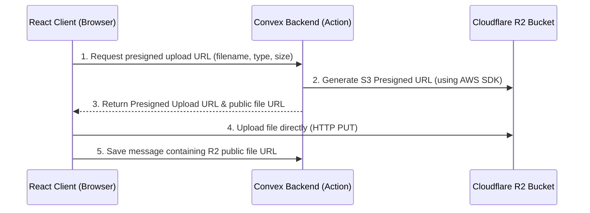

# Planning: Eliminating File Size Limitations

To achieve truly unlimited (or multi-gigabyte) file uploads, we must bypass proxy uploaders like UploadThing's free tier and server request size limits. 

Here is the analysis of the current limitations, the alternatives, and an implementation plan to achieve high-capacity direct uploads.

---

## 1. Current Storage & Upload Limits

| Platform | Single File Limit (Free Tier) | Single File Limit (Paid Tier) | Key Limitations / Notes |
| :--- | :--- | :--- | :--- |
| **Convex Document DB** | **1 MB** | **1 MB** | Applies to raw document fields (e.g. storing binary in a `v.bytes` field). |
| **Convex File Storage** | **30 MB** | **250 MB+** | Accessed via `ctx.storage.store()`. Limited by Convex HTTP request size limits. |
| **UploadThing** | **4 MB** (images)<br>**32 MB** (files) | **5 GB+** | Easy to use but restricted by their infrastructure tier limits. |
| **Direct Cloudflare R2 / S3** | **5 GB** (single PUT)<br>**5 TB** (multipart) | **5 GB** (single PUT)<br>**5 TB** (multipart) | Bypasses all server middleware. You are only limited by client bandwidth. |

---

## 2. Recommended Solution: Direct Uploads to Cloudflare R2

The most cost-effective and powerful way to eliminate file size limits is **Cloudflare R2** (or AWS S3) combined with **Presigned PUT URLs**.

### Why Cloudflare R2?
1. **No Egress Fees**: Unlike AWS S3, downloading files from R2 is 100% free. You only pay for storage.
2. **Generous Free Tier**: Includes **10 GB** of free storage per month.
3. **Huge File Limits**: Up to 5 GB for standard direct uploads, and up to 5 TB using multipart uploads.
4. **No Server Bottlenecks**: Files upload directly from the user's browser to Cloudflare's edge network, completely bypassing your Convex backend or Nitro server.

---

## 3. High-Level Architecture Flow



---

## 4. Step-by-Step Implementation Plan

If we decide to migrate to Cloudflare R2 direct uploads, here is how we would implement it:

### Step 1: Install AWS S3 SDK on Backend
We install the standard S3 SDK in our Convex backend to interact with the R2 bucket (since R2 uses the S3-compatible API):
```bash
npm install @aws-sdk/client-s3 @aws-sdk/s3-request-presigner
```

### Step 2: Define R2 Credentials on Convex
Set up R2 credentials in the Convex dashboard:
- `R2_ACCESS_KEY_ID`
- `R2_SECRET_ACCESS_KEY`
- `R2_ENDPOINT` (e.g., `https://<account_id>.r2.cloudflarestorage.com`)
- `R2_BUCKET_NAME`
- `R2_PUBLIC_DOMAIN` (your custom domain or R2 dev subdomain for downloading files)

### Step 3: Create a Presigned URL Generator Action
We write a Convex Node action `convex/r2.ts` to securely generate the upload URL:
```typescript
"use node";

import { action } from "./_generated/server";
import { v } from "convex/values";
import { S3Client, PutObjectCommand } from "@aws-sdk/client-s3";
import { getSignedUrl } from "@aws-sdk/s3-request-presigner";

const s3 = new S3Client({
  region: "auto",
  endpoint: process.env.R2_ENDPOINT,
  credentials: {
    accessKeyId: process.env.R2_ACCESS_KEY_ID!,
    secretAccessKey: process.env.R2_SECRET_ACCESS_KEY!,
  },
});

export const getPresignedUploadUrl = action({
  args: {
    fileName: v.string(),
    fileType: v.string(),
  },
  handler: async (ctx, args) => {
    // 1. Generate a unique key for the file
    const uniqueId = Math.random().toString(36).substring(2, 12);
    const fileKey = `${uniqueId}-${args.fileName}`;

    // 2. Build the command
    const command = new PutObjectCommand({
      Bucket: process.env.R2_BUCKET_NAME,
      Key: fileKey,
      ContentType: args.fileType,
    });

    // 3. Generate the presigned URL (valid for 15 minutes)
    const uploadUrl = await getSignedUrl(s3, command, { expiresIn: 900 });
    
    // 4. Construct the final public download URL
    const publicUrl = `${process.env.R2_PUBLIC_DOMAIN}/${fileKey}`;

    return { uploadUrl, publicUrl };
  },
});
```

### Step 4: Upload Directly from the Client
In our React UI (`src/routes/chat.tsx`), we write a handler that requests the URL and uploads the file:
```typescript
const startDirectUpload = async (file: File) => {
  // 1. Get presigned upload URL from Convex
  const { uploadUrl, publicUrl } = await getPresignedUrl({
    fileName: file.name,
    fileType: file.type,
  });

  // 2. Upload file directly using native fetch PUT request
  const response = await fetch(uploadUrl, {
    method: "PUT",
    headers: {
      "Content-Type": file.type,
    },
    body: file, // Sends raw binary stream directly to Cloudflare
  });

  if (!response.ok) {
    throw new Error("Upload failed");
  }

  return publicUrl; // The URL to save in Convex messages table
};
```

---

## 5. Summary of Benefits of the R2/S3 Plan
- **Zero size constraints**: You can easily upload 100MB+ images or 2GB videos without running into server memory crashes or API errors.
- **Maximum upload speeds**: The browser connects directly to Cloudflare's edge datacenters (closest to the user), maximizing upload bandwidth.
- **No intermediary fees**: Bypasses the UploadThing subscription costs for higher storage volumes.
